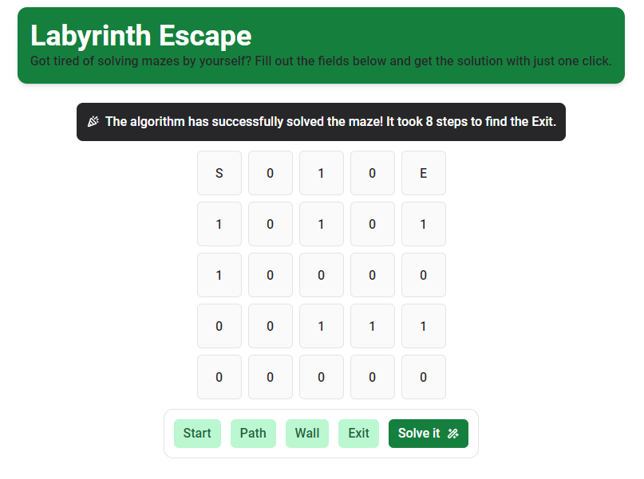

# Labyrinth Escape



## Overview

This project is a frontend application that can be set up and run using either Node.js and Yarn or Docker. Below are the instructions for both methods.

## Prerequisites

- **Node.js** (if using the Node.js/Yarn method)
- **Yarn** (if using the Node.js/Yarn method)
- **Docker** (if using the Docker method)

## Getting Started

### Method 1: Using Node.js and Yarn

1. **Install Dependencies**
   - Ensure you have Node.js and Yarn installed on your machine.
   - Navigate to the root folder of the project.
   - Run the following command to install all necessary packages:
     ```bash
     yarn
     ```

2. **Run the Project in Development Mode**
   - After installing the dependencies, start the development server with:
     ```bash
     yarn dev
     ```

   The application will be available at `http://localhost:4173` by default.

### Method 2: Using Docker

1. **Build the Docker Image**
   - Navigate to the root folder of the project.
   - Build the Docker image using the following command:
     ```bash
     docker build -t app_huridocs_challenge_image .
     ```

2. **Run the Docker Container**
   - After building the image, run the Docker container with:
     ```bash
     docker run -p 4173:4173 app_huridocs_challenge_image
     ```

   The application will be available at `http://localhost:4173` by default.

## Additional Information

- **Development Mode**: If running in development mode, the server will automatically reload on changes.
- **Docker**: Ensure that Docker is running and properly configured on your system.

## License

This project is licensed under the [MIT License](LICENSE).
